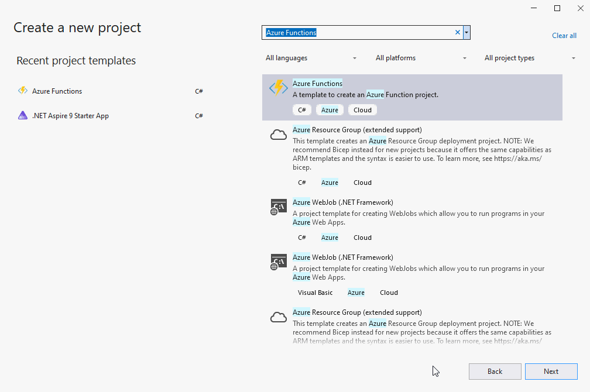
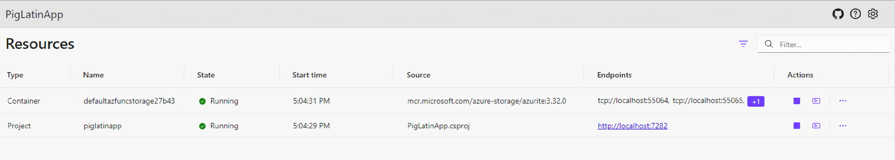
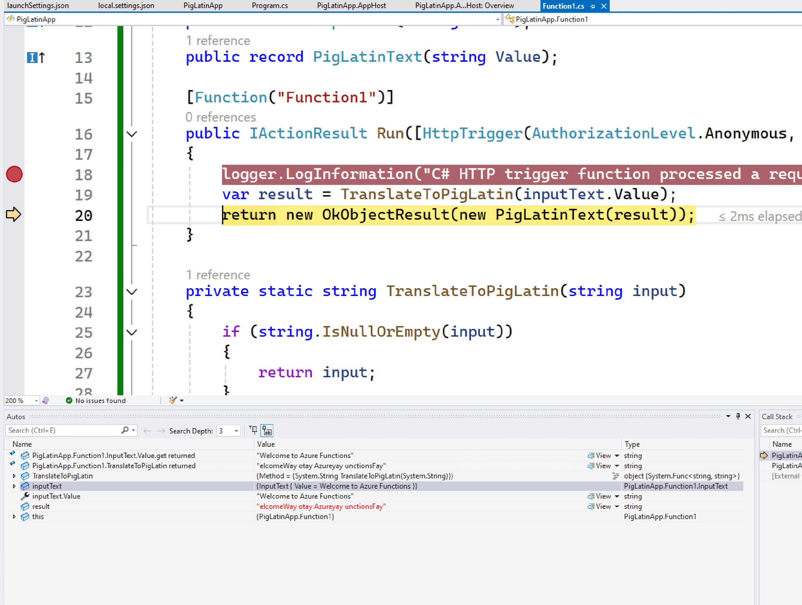

# Azure Functions Support (Preview)

Support for Azure Functions is one of the most widely requested features on the Aspire issue tracker and we're excited to introduce preview support for it in this release. To demonstrate this support, let's use Aspire to create and deploy Functions application for a popular scenario: a webhook.

To get started, create a new Azure Functions project using the Visual Studio New Project dialogue. When prompted, select the "Enlist in Aspire orchestration" checkbox when creating the project.



In the AppHost project, observe that there is a `PackageReference` to the new `Aspire.Hosting.Azure.Functions` package:

```xml
<ItemGroup>
<PackageReference Include="Aspire.Hosting.AppHost" Version="9.0.0-rc.1.24511.1" />
<PackageReference Include="Aspire.Hosting.Azure.Functions" Version="9.0.0-preview.5.24513.1" />
</ItemGroup>
```

This package provides an `AddAzureFunctionsProject` API that can be invoked in the AppHost to configure Azure Functions projects within an Aspire host:

```csharp
var builder = DistributedApplication.CreateBuilder(args);

builder.AddAzureFunctionsProject<Projects.PigLatinApp>("piglatinapp");

builder.Build().Run();
```

Our webhook will be responsible for translating an input string into Pig Latin. Let's update the contents of our trigger with the following code:

```csharp
using Microsoft.AspNetCore.Http;
using Microsoft.AspNetCore.Mvc;
using Microsoft.Azure.Functions.Worker;
using Microsoft.Extensions.Logging;
using System.Text;
using FromBodyAttribute = Microsoft.Azure.Functions.Worker.Http.FromBodyAttribute;

namespace PigLatinApp;

public class Function1(ILogger<Function1> logger)
{
    public record InputText(string Value);
    public record PigLatinText(string Value);

    [Function("Function1")]
    public IActionResult Run([HttpTrigger(AuthorizationLevel.Anonymous, "post")] HttpRequest req, [FromBody] InputText inputText)
    {
        logger.LogInformation("C# HTTP trigger function processed a request.");
        var result = TranslateToPigLatin(inputText.Value);
        return new OkObjectResult(new PigLatinText(result));
    }

    private static string TranslateToPigLatin(string input)
    {
        if (string.IsNullOrEmpty(input))
        {
            return input;
        }

        var words = input.Split(' ');
        StringBuilder pigLatin = new();

        foreach (string word in words)
        {
            if (IsVowel(word[0]))
            {
                pigLatin.Append(word + "yay ");
            }
            else
            {
                int vowelIndex = FindFirstVowelIndex(word);
                if (vowelIndex == -1)
                {
                    pigLatin.Append(word + "ay ");
                }
                else
                {
                    pigLatin.Append(word.Substring(vowelIndex) + word.Substring(0, vowelIndex) + "ay ");
                }
            }
        }

        return pigLatin.ToString().Trim();
    }

    private static int FindFirstVowelIndex(string word)
    {
        for (var i = 0; i < word.Length; i++)
        {
            if (IsVowel(word[i]))
            {
                return i;
            }
        }
        return -1;
    }

    private static bool IsVowel(char c) => char.ToLower(c) is 'a' or 'e' or 'i' or 'o' or 'u';
}
```

Set a breakpoint in the first line of the `Run` method and press <kbd>F5</kbd> to start the Functions host. Once the Aspire dashboard launches, you'll observe the following:




Aspire has:

- Configured an emulated Azure Storage resource to be used for bookkeeping by the host
- Launched the Functions host locally with the target as the Functions project registered
- Wired the port defined in `launchSettings.json` of the functions project for listening

Use your favorite HTTP client of choice to send a request to the trigger and observe the inputs bound from the request body in the debugger.

```
$ curl --request POST \
  --url http://localhost:7282/api/Function1 \
  --header 'Content-Type: application/json' \
  --data '{
  "value": "Welcome to Azure Functions"
}'
```



Now we're ready to deploy our application to ACA. Deployment currently depends on preview builds of Azure Functions Worker and Worker SDK packages. If necessary, upgrade the versions referenced in the Functions project:

```xml
<ItemGroup>
    <PackageReference Include="Microsoft.Azure.Functions.Worker" Version="2.0.0-preview1" />
    <PackageReference Include="Microsoft.Azure.Functions.Worker.Sdk" Version="2.0.0-preview2" />
</ItemGroup>
```

We'll also need to expose a public endpoint for our Azure Functions project so that requests can be sent to our HTTP trigger:

```csharp
builder.AddAzureFunctionsProject<Projects.PigLatinApp>("piglatinapp")
    .WithExternalHttpEndpoints();
```

To deploy the application via the `azd` CLI, navigate to the folder containing the AppHost project and run `azd init`:

```
$ azd init

Initializing an app to run on Azure (azd init)

? How do you want to initialize your app? Use code in the current directory

  (✓) Done: Scanning app code in current directory

Detected services:

  .NET (Aspire)
  Detected in: ./PigLatinApp/PigLatinApp.AppHost/PigLatinApp.AppHost.csproj

azd will generate the files necessary to host your app on Azure using Azure Container Apps.

? Select an option Confirm and continue initializing my app
? Enter a new environment name: azfunc-piglatin

Generating files to run your app on Azure:

  (✓) Done: Generating ./azure.yaml
  (✓) Done: Generating ./next-steps.md

SUCCESS: Your app is ready for the cloud!
```

Then, deploy the application by running `azd up`:

```
$ azd up 
? Select an Azure Subscription to use: 130. [redacted]
? Select an Azure location to use: 50. (US) West US 2 (westus2)

Packaging services (azd package)


Provisioning Azure resources (azd provision)
Provisioning Azure resources can take some time.

Subscription: [redacted]
Location: West US 2

  You can view detailed progress in the Azure Portal:
  [redacted]

  (✓) Done: Resource group: rg-azfunc-piglatin (967ms)
  (✓) Done: Container Registry: [redacted] (13.316s)
  (✓) Done: Log Analytics workspace: [redacted] (16.467s)
  (✓) Done: Container Apps Environment: [redacted] (1m35.531s)
  (✓) Done: Storage account: [redacted] (21.37s)

Deploying services (azd deploy)

  (✓) Done: Deploying service piglatinapp
  - Endpoint: {{endpoint-url}}

  Aspire Dashboard: {{dashboard-url}}
```

Finally, test your deployed Functions application using your favorite HTTP client:

```
$ curl --request POST \
  --url {{endpoint-url}}/api/Function1 \
  --header 'Content-Type: application/json' \
  --data '{
  "value": "Welcome to Azure Functions"
}'
```


Support for Azure Functions in Aspire is still in preview with support for a limited set of triggers including:

- HTTP triggers
- Azure Storage Queue triggers
- Azure Storage Blob triggers
- Azure Service Bus triggers
- Azure Event Hubs triggers

For the latest information on features support by the Azure Functions integration, see [the tracking issue](https://github.com/dotnet/aspire/issues/920).